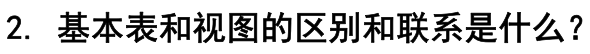
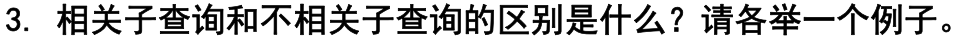

# 1


## 1)

```mysql
Select * From S
Where A = 10
```

## 2)

```mysql
Select A, B From S
```

## 3)

```mysql
Select S.A, S.B, S.C, S.D, T.E, T.F 
From S, T
Where S.C = T.C and S.D = T.D
```

## 4)

```mysql
Select S.A, S.B, S.C, S.D, T.C, T.D, T.E, T.F 
From S, T
Where S.C = T.C
```

## 5)

```mysql
Select S.A, S.B, S.C, S.D, T.C, T.D, T.E, T.F 
From S, T
Where S.A < T.E
```

## 6)

```mysql
Select S_New.C, S_New.D, T.C, T.D, T.E, T.F 
From (Select C, D From S) S_New, T
```

# 2

 

视图是从一个或几个基本表导出的虚拟表，其数据没有实际存储，数据库中只存放视图的定义而不存放视图对应的数据，这些数据仍然存放在原来的基本表中。一旦基本表中的数据发生变化，从视图中查询出来的数据也将发生变化。

视图具有和表一样的逻辑结构和定义，一经定义，就可以和基本表一样被查询、删除。视图的更新（增删改）有一定的限制，最终也将修改基本表里对应的数据。

# 3

 

* 相关子查询：相关子查询的结果依赖于父查询的返回值，子查询不可单独执行。

  如：

  ```mysql
  Select sno, sname From student
  Where EXISTS (Select * From sc Where sc.sno = student.sno)
  ```

* 无关子查询：子查询和父查询相互独立，子查询不依赖于父查询返回的任何记录，可以独立执行。

  如：

  ```mysql
  Select sno, sname From student 
  Where sno NOT IN (Select Distinct sno From sc)
  ```

  