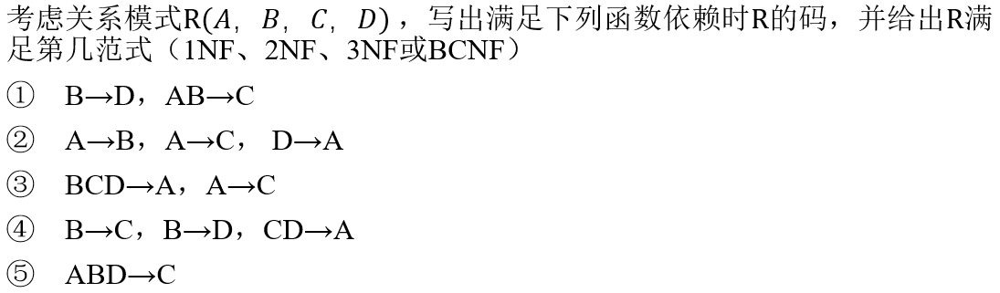
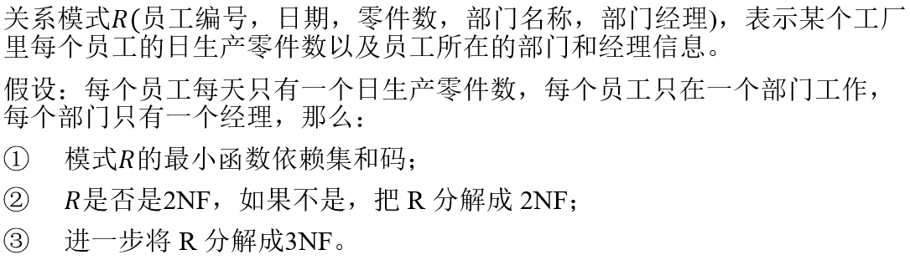

# 3.1

 

## 1

码是AB，R是1NF

## 2

码是D，R是2NF

## 3

码是BCD、ABD，R是3NF

## 4

码是B，R是2NF

## 5

码是ABD，R是BCNF

# 3.2

 

R可以表示为$$R(\underline{employee},\underline{date},number,department,manager)$$

函数依赖为$$\{\{employee,date\}\rightarrow number,employee\rightarrow department,department\rightarrow manager\}$$

## 1

最小函数依赖集为
$$
\{\{employee,date\}\rightarrow number,employee\rightarrow department,department\rightarrow manager\}
$$
码是$$\{date,employee\}$$

## 2

R不是2NF，因为$$employee\rightarrow department$$，即$$department$$部分依赖码$$\{employee,date\}$$

分解成2NF：$$R_1(\underline{employee},department,manager),R_2(\underline{employee},\underline{date},number)$$

## 3

分解成3NF：$$R_1(\underline{employee},department),R_2(\underline{department},manager),R_3(\underline{employee},\underline{date},number)$$

