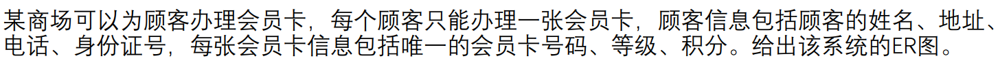
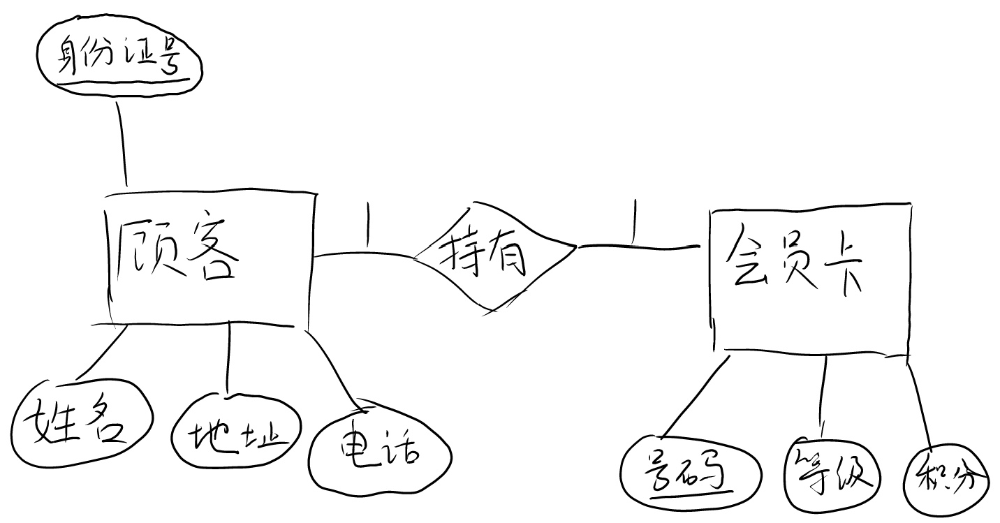
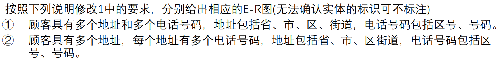
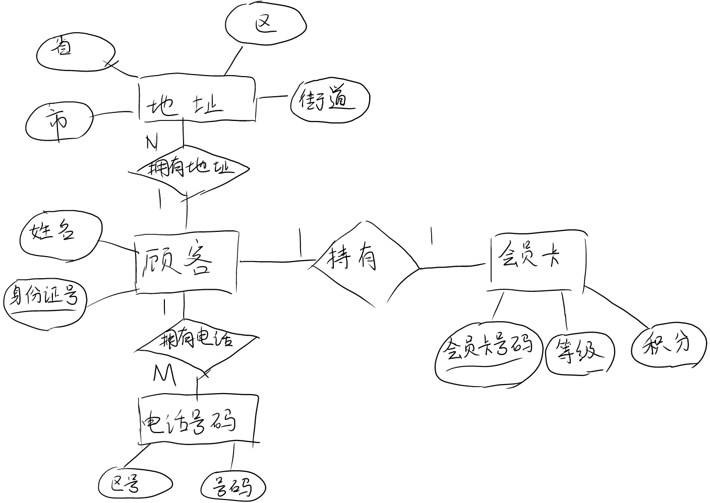
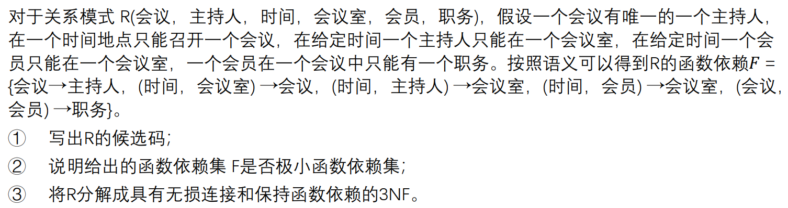

# 1

 

# 2

 

## 1)

## 2)

# 3

 

## 1)

$$\{时间，会员\}$$

## 2)

F是最小函数依赖集。

因为F满足以下条件：

* F中每个FD右边只有一个属性
* F不可约
* F的每个左部都不可约

## 3)

$$R_1(\underline{会议},主持人),R_2(\underline{时间},\underline{会议室},会议),R_3(\underline{时间},\underline{主持人},会议室), R_4(\underline{时间},\underline{会员},会议室),R_5(\underline{会议},\underline{会员},职务)$$